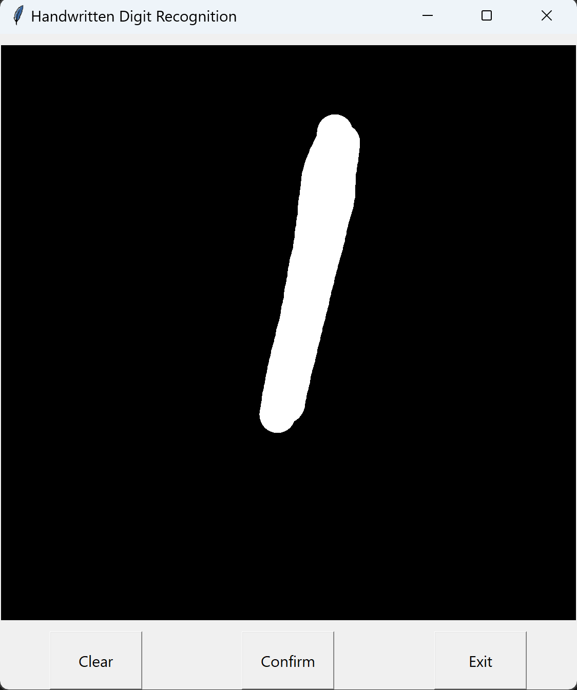
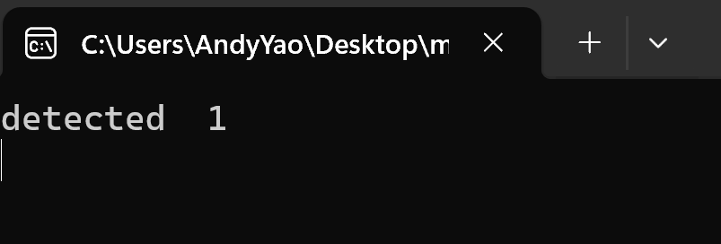

# Neural-Network-from-scratch for Handwirtten Digits


This project builds a 3-layer Neural Network from scratch to classify handwritten digits using the [MNIST database](http://yann.lecun.com/exdb/mnist/) for both training and testing, without using any framework but basic Numpy for implementation of mathematical operations.
 

## Files
*data_tocsv.py*:<br>
read images from JPG format in datasets into Numpy arrays, then save them into two csv files *trian_images.csv* and *test_images.csv*.

*train_network.py*:<br>
initialize parameters of the network, read train and test datasets from csv files and perform forward, back propagation and gradient descend tasks for training the network, then save learned parameters into a npz file *“network.npz”*.

*predict.py*:<br>
define functions used to make predictions, including intialize neural network and forward feed parameters through the network to make prediction. The prediction function sever as the main function to use previously trained neural network to predict the class of an image, or a folder of images, returns the predicted class in either single class or a list of classes depends on the given input.

*run_image.py*<br>
use an image path to make prediction with trained neural network.

*run_interactive.py*<br>
generate a canvas with python built-in tkinter library, allows user to draw digit on it. Cavnas is captured when confirm button is hit and the neural network is run behind the scence to make prediction of the hand-written digit.

## Network sizes
 1 Input Size -> 784*1 U

 2 First Layer -> 256*1 U
 
 3 Second Layer -> 64*1 U
 
 4 Output Layer -> 10 U


## Dataset

The MNIST data set of handwritten digits is a subset of a larger set available from [NIST](https://www.nist.gov/). MNIST contains a training set of 60,000 samples and test set of 10,000 samples. The digits have been size-normailised and centered in a fixed-size image. This application employs the MNIST dataset that was acquired on the internet.

Example of MNIST Digits


## Dependencies

This project mainly relies on Numpy for mathematical operations and Pillow/PIL for reading JPG images into Numpy arrays. <br>
Additionally, for better visualization and monitoring the progress of training, tqdm module was called to create the progress bars. Installing tqdm is required if visualiztion is needed. However, this module is unnecessary for training and using the network, and can be ignored at any times.<br>
In the interactive_run.py file, pyautogui is used to caputure the canvas image.

```
pip install numpy
pip install Pillow
pip install tqdm
pip install pyautogui
```
## Sample Usage
*run_interactive.py*<br>
the script will generate a canvas to draw digit on<br>



once the confirm button is hit, the predicted class will show on the terminal.



*run_image.py* <br>
this script takes a string path as input, and will open that path as the image and make prediction. The image can be a picture drawn by painter.


## Notes

Under the current hyperparameters, 10 epochs, a fixed learning rate of 0.001, the accuracy is about 85%. Higher accuracy can be acquired by increasing the number of epochs and changing learning rate.<BR>
When using hand drawing digits, the thickness of digits can sometimes affect the prediction results.
## License


Yann LeCun and Corinna Cortes hold the copyright of [MNIST database](http://yann.lecun.com/exdb/mnist/), which is a derivative work from original NIST datasets. [MNIST database](http://yann.lecun.com/exdb/mnist/) is made available under the terms of the [Creative Commons Attribution-Share Alike 3.0](http://creativecommons.org/licenses/by-sa/3.0/) license.